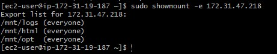
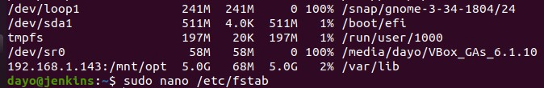

**Continous Integration Pipeline For Tooling Website**


Prerequisite

An NFS server with exports for mnt/opt




Network Information

- Jenkins  172.31.38.93

- NFS    172.31.47.218

- Web Server 1  192.168.1.223 


I will be building a Jenkins CI pipeline for a tooling website.

- I created a Jenkins server on Ubuntu 20.04

-Perform chmod on the /var/lib directory on the Jenkins server

```sudo chmod 777 /var/lib```


I Mounted /var/lib/ to store data on NFS server
```sudo mount 192.168.1.143:/mnt/opt /var/lib```

I checked the mount if persitent

`df -h`


- After mounting to make sure the mount persists, i added the follwing to the /etc/fstab configuration

```172.31.18.217:/mnt/opt  /var/lib	 nfs  defaults   0 0```

- I edited the host file on the Jenkins server

- Set up the Jenkins server

I  installed jenkins on the Jenkins Server

I added the repository key to the system as follows:

```wget -q -O - https://pkg.jenkins.io/debian-stable/jenkins.io.key | sudo apt-key add -```