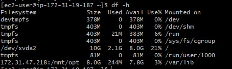

**Continous Integration Pipeline For Tooling Website on AWS**


Network Information

- Jenkins  172.31.17.187(Red Hat AMI)

- NFS    172.31.47.218(Red Hat AMI)

- Web Server 1  192.168.1.223 


Prerequisite

An existing NFS server with exports for `mnt/opt`

On the Jenkins server i checked the shared NFS folders as shown below


I will be building a Jenkins CI pipeline for a tooling website.

-I backed up the `/var/lib` directory on the Jenkins server as follows:

`sudo mkdir -p /home/recovery/libs`
`sudo rsync -avz --no-o --no-g --no-perms /var/lib /home/recovery/libs`


- I Mounted /var/lib/ to store data on NFS server
```sudo mount 172.31.47.218:/mnt/opt /var/lib```

I checked the mount if persitent

`df -h`


- After mounting to make sure the mount persists, i added the follwing to the /etc/fstab configuration

`172.31.47.218:/mnt/opt  /var/lib	 nfs  defaults   0 0`

- I copied back the content of /var/lib because mounting on it must have wiped the content
 `sudo rsync -avz --no-o --no-g --no-perms /home/recovery/libs/lib/ /var/lib`


- I edited the host file on the Jenkins server

- Set up the Jenkins server

I  installed jenkins on the Jenkins Server

I added the repository key to the system as follows:

```wget -q -O - https://pkg.jenkins.io/debian-stable/jenkins.io.key | sudo apt-key add -```

`sudo rpm --import https://jenkins-ci.org/redhat/jenkins-ci.org.key`

`sudo yum upgrade`

`sudo yum install jenkins java-devel`