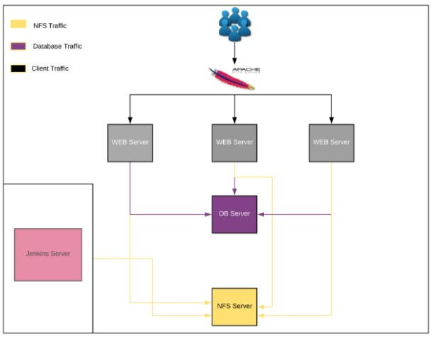

# Continous-Integration-Pipeline-For-Tooling-Website

To guaranty Agility(quick software release and web solutions) in DevOps, Automation is required. In this project we use Continous Integration to enable fast release of software and agility. In this project, we are required to implement CI for Tooling Website using Jenkins.

[Project Notes]()

